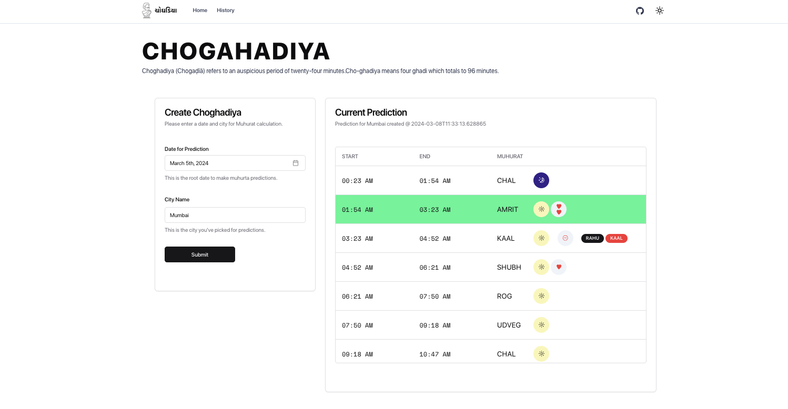
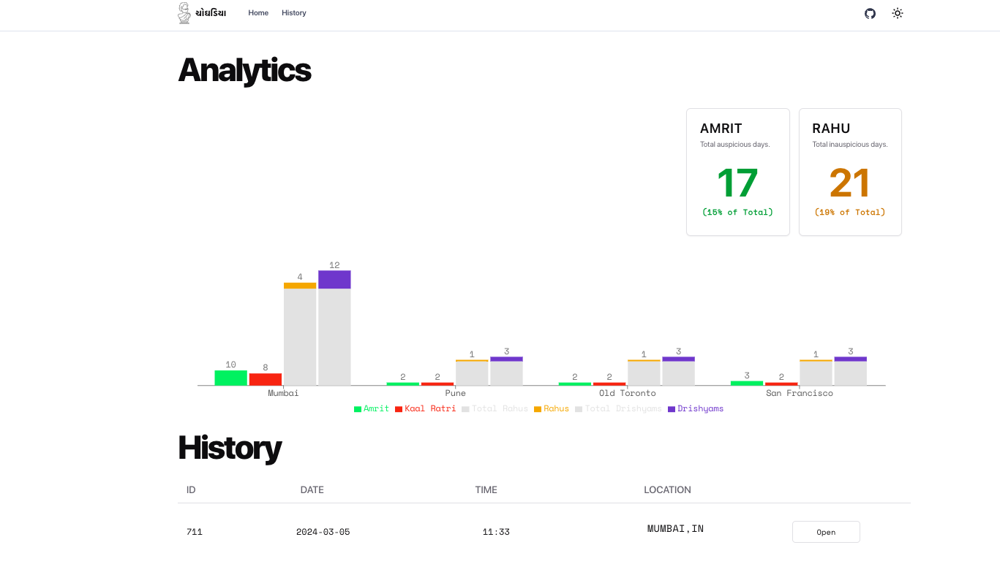

# Choghadiya
Choghadiya (Chogaḍīā) refers to an auspicious period of twenty-four minutes in Indian astrology.

## Etymology
Ghadi (now used for a clock in Hindi) is an ancient measure for calculations of time in India roughly equivalent to 24 minutes. Cho-ghadiya means four ghadi which totals to 96 minutes. Most of choghadiya are of a figure around 96 minutes.

## About
it is advisable to perform necessary prayers, on a particular time phase of the day to get maximum benefits of health, wealth and prosperity. One can get the appropriate time of Muhurta (Auspicious Occasion) from the Panchang.

## Types of Choghadiya

### Auspicious
- Amrit
- Shubh
- Labh are considered the most auspicious Choghadiyas. (Time Period)
- Chal is considered as good Choghadiya . (Time Period)
  
### Inauspicious
- Udveg
- Kal
- Rog is considered inauspicious.

Amrit, Shubh and Labh are considered the most auspicious Choghadiyas. (Time Period). Chal is considered as good Choghadiya. Udveg, Kal and Rog is considered inauspicious.

## Method of Calculation
- Each day is divided into two time periods: Daytime - the period from sunrise to sunset Nighttime - the period from sunset to sunrise.
- Each period contains eight Choghadiya's. The daytime difference is arrived at by calculating the difference between Sunrise and Sunset and dividing the same by 8.
  
While the cyclic order remains the same, the first choghadiya changes from Labh to Shubh. The order is decided by the day of the week. The first and last Choghadiya of the day on each day is ruled by the lord of the day. For example, on Monday, the first Muhurata is Amrit, which is ruled by the Moon and followed by other planets. The good or bad Choghadiya Muhurat based on the nature and merits of the lord.

#### Day Choghadiya:

|  Sun  |  Mon  | Tue     | Wed   | Thu   | Fri   | Sat   |
|-------|-------|---------|-------|-------|-------|-------|
| Udveg | Amrit | Rog     | Labh  | Shubh | Chal  | Kaal  |
| Chal  |  Kaal | Udveg   | Amrut | Rog   | Labh  | Shubh |
| Labh  | Shubh | Chal    | Kaal  | Udveg | Amrit | Rog   |
| Amrit | Rog   | Labh    | Shubh | Chal  | Kaal  | Udveg |
| Kaal  | Udveg | Amrit   | Rog   | Labh  | Shubh | Chal  |
| Shubh | Chal  | Kaal    | Udveg | Amrit | Rog   | Labh  |
| Rog   | Labh  | Shubh   | Chal  | Kaal  | Udveg | Amrit |
| Udveg | Amrit | Rog     | Labh  | Shubh | Chal  | Kaal  |

#### Night Choghadiya:

|  Sun  | Mon   | Tue   | Wed   | Thu   | Fri   | Sat   |
|-------|-------|-------|-------|-------|-------|-------|
| Shubh | Chal  | Kaal  | Udveg | Amrit | Rog   | Labh  |
| Amrit | Rog   | Labh  | Shubh | Chal  | Kaal  | Udveg |
| Chal  | Kaal  | Udveg | Amrit | Rog   | Labh  | Shubh |
| Rog   | Labh  | Shubh | Chal  | Kaal  | Udveg | Amrit |
| Kaal  | Udveg | Amrit | Rog   | Labh  | Shubh | Chal  |
| Labh  | Shubh | Chal  | Kaal  | Udveg | Amrit | Rog   |
| Udveg | Amrit | Rog   | Labh  | Shubh | Chal  | Kaal  |
| Shubh | Chal  | Kaal  | Udveg | Amrit | Rog   | Labh  |

> Example

Day 1: Sunrise at 6:00 AM and Sunset at 6:01 pm Day 2: Sunrise at 6:00 am
Based on the above The daytime period is 12 hours and 01 minutes (721 minutes). The nighttime period is 11 hours and 59 minutes (719 minutes).

Therefore, each daytime Choghadiya lasts 721/8 = 90.125 minutes = 1 hour 30 minutes 7.5 seconds And each night-time Choghadiya last 736/8 = 92 minutes = 1 hour 29 minutes 52.5 second

### On Kaal Vela, Kall ratri, Vaar Vela

दिनमान को आठ भाग और रात्रिमान को आठ भाग करने से , हर एक भाग को " चौघड़िया " , जिसे बंगाली मे " यामार्द्ध " कहा जाता है । इस चोघड़िया के हिसाब से ही बार वेला , काल वेला और काल रात्रि का समय निकाला जाता है । रविवार ते चौथा और पांचवा , सोमवार को सातवां और दुसरा , मंगल को दुसरा और छठा , बुध को पांचवा और तीसरा , गुरु को अष्टम और सातवां , शुक्र को तीसरा और चतुर्थ , शनि को छठा , पहला और अष्टम चौघड़िया को यथाक्रम से बार वेला और कालवेला कहा जाता है । रात को रविवार को छठा , सोम को चोथा , मंगल को दुसरा , बुध को सातवां , गुरु को पांचवा , शुक्र को तीसरा , शनि को पहला और अष्टम चौघड़िया को काल रात्रि कहा जाता है । बार वेला , काल वेला और काल रात्रि को शुभ कार्य करना मना होता है ।

### On Rahu Kaala
- Monday - 2nd Time-segment of the day after Sunrise
- Tuesday - 7th Time-segment of the day after Sunrise
- Wednesday - 5th Time-segment of the day after Sunrise
- Thursday - 6th Time-segment of the day after Sunrise
- Friday - 4th Time-segment of the day after Sunrise
- Saturday - 3rd Time-segment of the day after Sunrise
- Sunday - 8th Time-segment of the day after Sunrise


## Application
This application is built as a fullstack `Next.js` frontend and `fastapi` for backend.

### How to use

1. Clone the repo
```sh
git clone https://github.com/sinhaGuild/choghadiya.git
```
2. Run the application
```sh
cd choghadiya
npm run dev
```
3. Navigate to Main UI - `http://localhost:3000/`
4. Navigate to API Portal - `http://127.0.0.1:8000/api/docs`


### Screenshots
  
  
  

